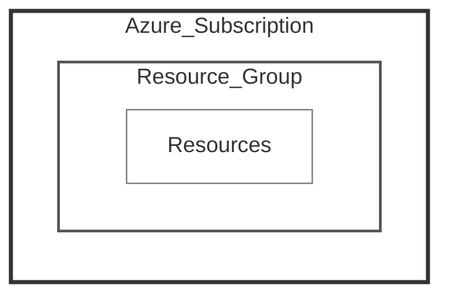

# Provedor Cloud Azure

 Conjunto abrangente de serviços de computação em nuvem criado pela Microsoft.   
 
 Ele permite que você construa, implemente e gerencie aplicativos e serviços através de uma rede global de data centers gerenciados pela Microsoft.

## Principais Produtos e Serviços Azure

```Análise```
* Azure Databricks;
* Azure Stream Analystics;
* Azure HDInsight;
* Data Factory;
* Data Lake Analytics;
* Event Hub;
* Azure Analysis Services;
* Data Catalog;
* Azure Data Lake Storage;
* Azure Data Explorer

```Armazenamento```
  * Storage;
  * Azure Backup;
  * Blob storage;
  * Azure Disk Storage;
  * Azure Files;

```Banco de Dados```
  * SQL Server on Virtual Machines;
  * Azure SQL Database;
  * Azure Cosmos DB;
  * Azure Cache for Redis;
  * Table storage;
  * Azure Database Migration Service;

```Computação```
  * Virtual Machines;
  * Azure Virtual Machine Scale Sets;
  * Azure Functions;
  * App Service;
  * Batch;
  * Azure Kubernetes Service (AKS);
  * Container Instances
  * Container Registry;

Para mais produtos clique [aqui](https://azure.microsoft.com/en-us/products/).

# Grupo de recursos

Permite organizar os serviços da conta.

**Ordem:**



## Controlar Gerenciar e Proteger os recursos

* Tags;
* Locks:
* IAM;
* Policies.
